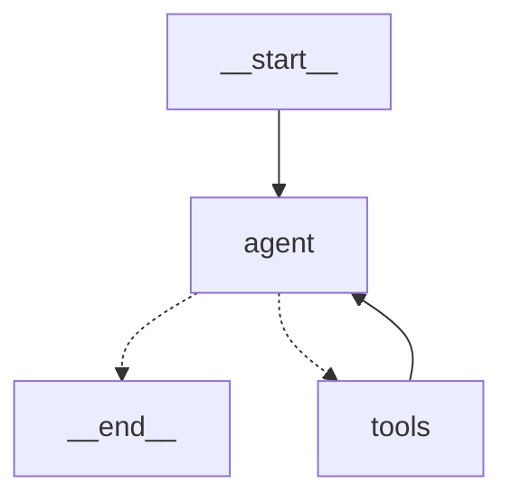

# Day 4 Progress Report: Proper Agent Architecture Refactor

## Summary

Refactored from **hardcoded chain pattern** to **proper ReAct Agent with Tools**.

## Problem Identified

The original implementation was essentially the same as the old version:
- Hardcoded routing: `if intent == "property" → call_property_function()`
- No tool definitions
- LLM only for text generation, not decision making

This is NOT a proper agent. It's just a reorganized chain.

## Solution: LangGraph ReAct Agent

### New Architecture

```
User Message
     ↓
  [Agent] LLM with tools bound
     ↓
  ┌─────────────────────────┐
  │ LLM decides:            │
  │ - Respond directly? OR  │
  │ - Call a tool?          │
  └─────────────────────────┘
     ↓
  [Tools] Execute tool (search, tips, etc.)
     ↓
  [Agent] Observe results, decide next action
     ↓
  (Loop until LLM has enough info)
     ↓
  Final Response
```

### Key Files Created

1. **`src/agents/tools.py`**
   - Tool definitions with `@tool` decorator
   - Proper Pydantic schemas for structured input
   - Tools:
     - `search_properties` - Search property database
     - `get_property_detail` - Get single property info
     - `search_knowledge` - Search knowledge base
     - `get_sales_tips` - Sales technique tips
     - `get_motivation` - Motivational messages

2. **`src/agents/react_agent.py`**
   - `ReActPropertyAgent` class
   - Uses `model.bind_tools(tools)` - LLM can call tools
   - Uses `ToolNode` and `tools_condition` from langgraph.prebuilt
   - Proper ReAct loop: agent → tools → agent → ...

3. **`scripts/test_react_agent.py`**
   - Test script with streaming support
   - Interactive mode for manual testing

## Old vs New Comparison

### Old Pattern (Hardcoded Chain)
```python
# Classify intent with LLM
intent = classifier_chain.invoke({"message": user_input})

# Hardcoded routing
if intent == "property_search":
    result = property_agent.search(criteria)
elif intent == "coaching":
    result = coach_agent.respond(message)
```

### New Pattern (Proper Agent)
```python
# LLM with tools bound
llm_with_tools = llm.bind_tools([
    search_properties,
    get_property_detail, 
    search_knowledge,
    get_sales_tips,
    get_motivation,
])

# ReAct loop - LLM DECIDES which tool to call
graph = StateGraph()
graph.add_node("agent", call_llm_with_tools)
graph.add_node("tools", ToolNode(tools))
graph.add_conditional_edges("agent", tools_condition, ...)
graph.add_edge("tools", "agent")  # Loop back
```

## Test Results

All test queries working:

| Query | Tool Called | Result |
|-------|-------------|--------|
| "cari rumah di cemara asri" | `search_properties(query="cemara asri", property_type="house")` | ✅ 20+ results |
| "ada ruko di sunggal?" | `search_properties(query="sunggal", property_type="shophouse")` | ✅ Multiple results |
| "tips untuk closing" | `get_sales_tips(topic="closing")` | ✅ Tips returned |
| "kasih motivasi" | `get_motivation()` | ✅ Motivation returned |
| "Halo!" | (no tool) | ✅ Direct response |

## Graph Visualization



## Next Steps

1. **Pagination Support** - Add `page` parameter to `search_properties` tool
2. **Memory Integration** - Track which properties already shown
3. **Knowledge Base** - Populate ChromaDB with real estate knowledge
4. **Hybrid Search** - Combine API filter + vector semantic ranking
5. **Update/Create Tools** - Add tools for property modification (with permissions)

## Files Changed

- Created: `src/agents/tools.py`
- Created: `src/agents/react_agent.py`  
- Created: `scripts/test_react_agent.py`
- Dependencies: Added `nest_asyncio` for async handling

## Running the Agent

```powershell
cd D:\Project\Rag-Tesis
.\venv\Scripts\Activate.ps1
$env:PYTHONIOENCODING="utf-8"
python scripts/test_react_agent.py

# For streaming mode (see tool calls):
python scripts/test_react_agent.py --stream
```
